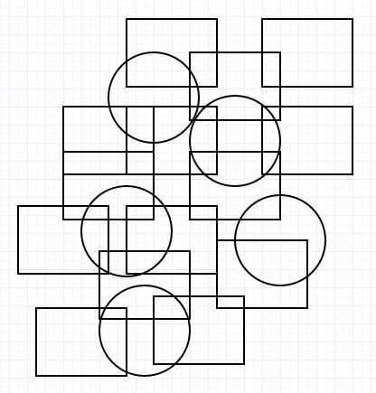
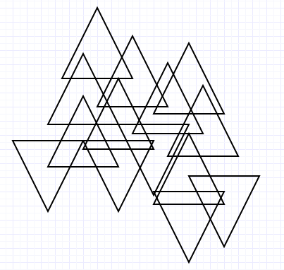
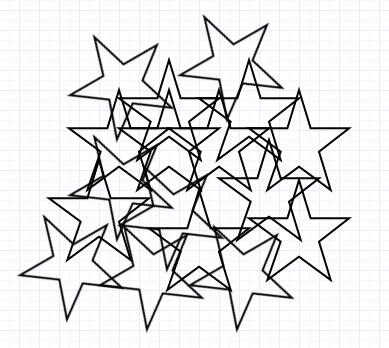

## Introducing

This is example of augment reality on Python and OpenCV 3.0+

### How to use

You need last version of OpenCV library(i used 3.0.0-beta). You must [download](http://opencv.org/downloads.html) and build it for your OS. 

Also before you build OpenCV you must to download [opencv-contrib](https://github.com/Itseez/opencv_contrib) for some application features.

Then I offer you few images what you can print for pattern detection.

For run application:

`$ python main.py`

### Images






If you need help use argument `$ python main.py -h`

```
optional arguments:
  -h, --help            show this help message and exit
  -a {TRACKER,AR}, --app {TRACKER,AR}
                        Type of application - just tracker or augment reality.
  -f FILE, --file FILE  Name of target image.
  -t {ORB,SIFT,SURF}, --type {ORB,SIFT,SURF}
                        Method of feature detection.
  -m {BOX,PIRAMID}, --model {BOX,PIRAMID}
                        The model that will be added.
```